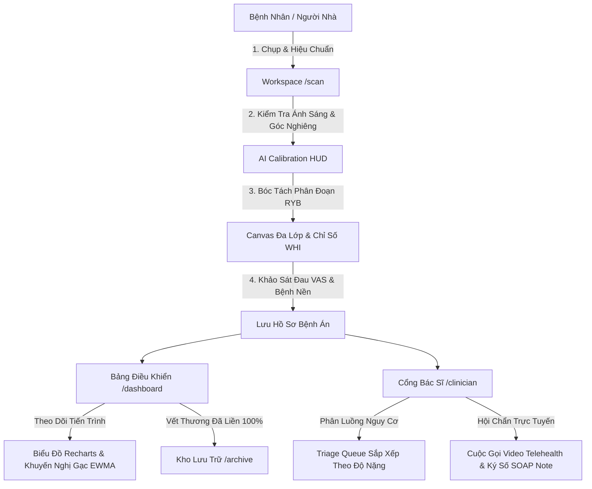

# LANT — Lesion Analysis & Necrotic Tissue Vision System
### Hệ Thống Thị Giác Máy Tính Y Tế Giám Sát & Phân Tích Vết Thương Hở Cá Nhân Hóa

[](https://nextjs.org/)
[](https://www.typescriptlang.org/)
[](https://tailwindcss.com/)
[](https://ewma.org/)
[](https://www.hhs.gov/hipaa/index.html)

---

## 📖 1. Giới Thiệu & Sứ Mệnh Dự Án

**LANT (Lesion Analysis & Necrotic Tissue Vision System)** là nền tảng thị giác máy tính và y tế từ xa (Telehealth) tiên tiến, được thiết kế nhằm mục đích:

> *"Tự động hóa việc phân tích hình thái học vết thương hở, đo đạc diện tích thực tế ($cm^2$), bóc tách phân đoạn mô hạt/vảy/hoại tử (RYB), tính toán chỉ số lành thương WHI và đưa ra khuyến nghị phác đồ băng gạc tại gia chuẩn y khoa (EWMA/WUWHS), đồng thời kết nối bệnh nhân với Bác sĩ chuyên khoa thông qua cổng Telehealth trực tuyến."*

---

## 🎨 2. Hệ Thống Nhận Diện Thiết Kế (Monochromatic Clinical Blue)

Giao diện được xây dựng theo triết lý y khoa hiện đại, đem lại cảm giác tin cậy, chính xác và chuyên nghiệp:

| Token Màu | Mã Hex | Ý Nghĩa / Vị Trí Ứng Dụng |
| :--- | :--- | :--- |
| **Oceanic Azure** | `#002B8C` | Màu thương hiệu chủ đạo, Header, CTA chính, viền tiêu điểm |
| **Dusk Blue** | `#3E5D8E` | Phụ đề, nhãn thẻ, viền phân tách mềm |
| **Sapphire** | `#0F52BA` | Điểm nhấn tương tác, đường biểu đồ active, liên kết |
| **Azure Mist** | `#F0FFFF` | Nền thẻ nổi bật, huy hiệu trạng thái, cảnh báo mềm |
| **Indigo Contrast** | `#282888` | Tiêu đề tương phản cao, vùng nhấn cổng Bác sĩ |
| **Tissue Granulation (Red)** | `#DC2626` | Mô hạt lành tính, vi mao mạch đang phát triển |
| **Tissue Slough (Yellow)** | `#F59E0B` | Mô vảy fibrin, nguy cơ nhiễm trùng / bio-film |
| **Tissue Necrotic (Black)** | `#111827` | Mô hoại tử khô (Eschar), cảnh báo khẩn cấp |
| **Tissue Epithelial (Pink)** | `#EC4899` | Rìa mép da non đang khép miệng vết thương |
| **Safe Recovery (Green)** | `#10B981` | Tiến trình hồi phục tích cực, diện tích co nhỏ |

---

## 🧮 3. Kiến Trúc Thuật Toán & Công Thức Y Sinh

Hệ thống tích hợp chính xác các quy chuẩn toán học lâm sàng:

### 1. Quy Đổi Pixel Sang Kích Thước Vật Lý (ArUco Marker Calibration)
Sử dụng vật chuẩn (ArUco tag 2.0 cm hoặc đồng xu chuẩn) để triệt tiêu biến dạng quang học:
$$\text{Ratio} = \frac{\text{Kích Thước Vật Chuẩn (cm)}}{\text{Kích Thước Pixel Đếm Được (px)}} \quad (\text{cm/px})$$
$$\text{Diện Tích Vết Thương } (cm^2) = \text{Tổng Số Pixel Vùng Mặt Cắt Vết Thương} \times \text{Ratio}^2$$

### 2. Thành Phần Bóc Tách Mô Học (Tissue RYB Proportion)
$$\text{Tổng Diện Tích Vết Thương} = P_{\text{Red}} + P_{\text{Yellow}} + P_{\text{Black}} + P_{\text{Pink}} = 100\%$$

### 3. Chỉ Số Sức Khỏe Vết Thương (Wound Health Index — WHI)
Thang điểm tổng hợp từ 0 đến 100 phản ánh chất lượng nền mô và tốc độ hồi phục:
$$\text{WHI} = \text{Clamp}_{0}^{100}\left( (\%Red \times 1.0) + (\%Pink \times 1.2) - (\%Yellow \times 1.5) - (\%Black \times 3.0) \right)$$

### 4. Biến Thiên Phục Hồi Theo Chuỗi Thời Gian (Recovery Delta)
$$\Delta_{\text{Prev}} = \frac{\text{Area}_{t-1} - \text{Area}_t}{\text{Area}_{t-1}} \times 100\% \quad (\text{\% Giảm so với lần quét trước})$$
$$\Delta_{\text{Base}} = \frac{\text{Area}_0 - \text{Area}_t}{\text{Area}_0} \times 100\% \quad (\text{\% Giảm so với ngày đầu tiếp nhận})$$

### 5. Ngưỡng Cảnh Báo Nguy Cơ Hoại Tử Tự Động (Smart Critical Thresholds)
- **BÁO ĐỘNG ĐỎ CẤP CỨU**: Tự động kích hoạt khi $\%Black \ge 10\%$ HOẶC $\%Yellow \ge 35\%$ (Đưa ra hướng dẫn gọi cấp cứu 115 và bệnh viện ngoại khoa gần nhất để phẫu thuật cắt lọc Debridement).
- **CẢNH BÁO TIẾN TRIỂN XẤU**: Tự động kích hoạt khi $\Delta_{\text{Prev}} < -10\%$ (Diện tích vết thương mở rộng bất thường).

---

## 🚀 4. Các Tính Năng & Phân Hệ Cốt Lõi



### 1. Không Gian Chụp, Hiệu Chuẩn & Khảo Sát (`/scan`)
- Hộp nhận diện tiêu cự vật chuẩn **ArUco 2cm** với độ tin cậy $98.4\%$.
- Bộ đo cảm biến góc nghiêng ống kính ($< 5^\circ$ tối ưu trực giao) và mức ánh sáng môi trường ($Lux$).
- Bộ dữ liệu mẫu đa dạng: *Loét bàn chân đái tháo đường (DFU), Hở vết mổ sau phẫu thuật, Loét tì đè cùng cụt (Stage III), Bỏng nhiệt độ II*.
- **Khảo sát lâm sàng Intake**: Thang điểm đau VAS 0-10 (Wong-Baker), phân loại dịch tiết, mùi hôi và danh sách bệnh nền (Đái tháo đường, PAD, Tăng huyết áp...).

### 2. Bảng Theo Dõi Bệnh Án & Lớp Phân Đoạn AI (`/dashboard`)
- **Interactive HTML5 Canvas**: Bật/tắt tùy biến từng lớp bóc tách mô sinh học (Mô đỏ, Vảy vàng, Hoại tử đen, Rìa mép hồng, Viền chu vi, Lưới ArUco) cùng thanh trượt độ trong suốt.
- **Biểu đồ chuỗi thời gian Recharts**: Trục kép đối chiếu diện tích $cm^2$ và điểm số WHI theo các mốc *Ngày 0, Ngày 5, Ngày 11, Ngày 17*.
- **Hệ thống hỗ trợ quyết định lâm sàng (CDSS)**: Tự động đề xuất gạc tiếp xúc trực tiếp (Primary Dressing: Hydrogel, Silver Alginate, Polyurethane Foam) kèm quy trình 4 bước vệ sinh chuẩn.

### 3. Cổng Bác Sĩ Phân Luồng & Hội Chẩn Telehealth (`/clinician`)
- **Triage Queue**: Tự động sắp xếp bệnh nhân theo mức độ nguy kịch (Ưu tiên ca có mô hoại tử đen eschar lên đầu danh sách).
- **Bộ tua thời gian Time-Series Scrubber**: Đối chiếu hình ảnh vết thương qua các lần khám.
- **Phòng Khám Telehealth Trực Tuyến**: Giao diện mô phỏng WebRTC chia đôi màn hình (Camera Bác sĩ/Bệnh nhân song song với Khung hình vết thương thời gian thực).
- **Tạo Bệnh Án Điện Tử SOAP Tự Động**: Bác sĩ kiểm tra, chỉnh sửa và **Ký số điện tử (Digital Signature)** gửi phác đồ về máy người bệnh.

### 4. Kho Lưu Trữ Ca Đã Liền & Nhắc Nhở Tuân Thủ (`/archive`)
- Lưu trữ các ca đạt $100\%$ biểu mô hóa hoặc diện tích $\le 0.1cm^2$.
- Thống kê đối chiếu trước và sau điều trị (Before & After).
- **Lịch nhắc thay băng**: Cấu hình thời gian gửi thông báo (Push App, SMS Zalo, Email) và đếm chuỗi tuân thủ (Streak).

---

## 📁 5. Cấu Trúc Thư Mục Dự Án

```
c:/My-Project/Project-LANT/
├── .antigravity/                   # Hệ thống bộ nhớ Anti-Hallucination
│   ├── LANT_PROJECT_MANIFEST.md    # Chân lý dự án & công thức y sinh
│   ├── TASK_PROGRESSION.json       # Tiến độ công việc máy đọc
│   └── EXECUTION_LOG.md            # Nhật ký thực thi & tự sửa lỗi
├── src/
│   ├── app/
│   │   ├── layout.tsx              # Layout chung & Phông chữ Inter/JetBrains Mono
│   │   ├── page.tsx                # Trang chủ & Cổng điều hướng đa vai trò
│   │   ├── scan/page.tsx           # Không gian chụp & hiệu chuẩn ArUco
│   │   ├── dashboard/page.tsx      # Bảng điều khiển bệnh nhân & Canvas RYB
│   │   ├── archive/page.tsx        # Kho lưu trữ ca bệnh đã liền
│   │   ├── clinician/
│   │   │   ├── page.tsx            # Cổng phân luồng nguy cơ Bác sĩ
│   │   │   └── [patientId]/page.tsx # Xem chi tiết ca bệnh & Hội chẩn Telehealth
│   │   └── globals.css             # Tailwind & Glassmorphism styles
│   ├── components/
│   │   ├── navbar.tsx              # Thanh điều hướng, bộ chuyển đổi hồ sơ
│   │   ├── wound-canvas.tsx        # Canvas bóc tách mô học RYB tương tác
│   │   ├── recovery-chart.tsx      # Biểu đồ Recharts xu hướng phục hồi
│   │   ├── intake-survey-modal.tsx # Modal khảo sát triệu chứng đau VAS
│   │   ├── dressing-recommender.tsx # Khuyến nghị băng gạc chuẩn EWMA
│   │   ├── hazard-alert.tsx        # Modal cảnh báo đỏ cấp cứu 115
│   │   ├── reminder-modal.tsx      # Cài đặt lịch nhắc & chuỗi Streak
│   │   └── telehealth-call-modal.tsx # Phòng gọi Telehealth & Ký SOAP Note
│   ├── lib/
│   │   ├── ai-vision-mock.ts       # Động cơ toán học & mô phỏng AI
│   │   ├── mock-storage.ts         # Tầng lưu trữ LocalStorage quan hệ
│   │   └── utils.ts                # Helper xử lý CSS & format y khoa
│   └── types/
│       └── medical-schema.ts       # TypeScript Schema chuẩn mực y tế
├── tailwind.config.ts              # Cấu hình bảng màu Oceanic Azure
├── package.json
└── tsconfig.json
```

---

## 🛠️ 6. Hướng Dẫn Cài Đặt & Chạy Thử Nghiệm

### Yêu cầu môi trường:
- **Node.js**: Phiên bản `>= 18.x` (Đã xác thực hoạt động ổn định trên Node v24.x)
- **npm**: `>= 9.x`

### Các bước khởi chạy:

1. **Clone hoặc chuyển vào thư mục dự án**:
   ```bash
   cd c:/My-Project/Project-LANT
   ```

2. **Cài đặt các gói phụ thuộc (Dependencies)**:
   ```bash
   npm install
   ```

3. **Khởi chạy Development Server**:
   ```bash
   npm run dev
   ```
   Ứng dụng sẽ khả dụng tại địa chỉ: **`http://localhost:3000`**

4. **Kiểm tra biên dịch Production Build**:
   ```bash
   npm run build
   ```

---

## 🔮 7. Lộ Trình Nâng Cấp: Tích Hợp Model AI & Backend Thực Tế

Kiến trúc hiện tại của **LANT** được đóng gói dạng module độc lập (Plug-and-Play), sẵn sàng cho các giai đoạn nâng cấp tiếp theo:

1. **Huấn Luyện Model AI Thị Giác Y Khoa**:
   - Tích hợp các kiến trúc Segmentation hàng đầu: **SAM-Med2D**, **SegFormer**, **Attention U-Net**, hoặc **YOLOv8-Seg** huấn luyện trên tập dữ liệu *Medetec / AZH Wound Care / WoundsDB*.
   - Triển khai dịch vụ suy luận AI bằng **FastAPI / Triton Server** hoặc export sang **ONNX WebGPU** chạy trực tiếp trên trình duyệt.
2. **Backend & Cơ Sở Dữ Liệu Thực Tế**:
   - Sử dụng **PostgreSQL** kết hợp **Prisma ORM** để thay thế `mock-storage.ts`.
   - Lưu trữ ảnh y tế trên **AWS S3 / Cloudflare R2** với tính năng mã hóa lưu trữ (**SSE-S3 AES-256**) và cấp quyền truy cập qua **Presigned URLs** có thời hạn.
3. **Bảo Mật Y Tế Đạt Chuẩn (HIPAA / GDPR / Nghị định 13/2023/NĐ-CP)**:
   - Phân quyền nghiêm ngặt **RBAC** (Bệnh nhân chỉ xem hồ sơ của mình, Bác sĩ chỉ xem bệnh nhân được chỉ định).
   - Tự động khử định danh dữ liệu (**De-identification**) trước khi đưa ảnh vào huấn luyện.
   - Ghi nhật ký truy vết y khoa (**Audit Logging**) chống rò rỉ bệnh án.

---

## ⚠️ Tuyên Bố Miễn Trừ Trách Nhiệm Y Khoa (Clinical Disclaimer)

*Hệ thống LANT được xây dựng với mục đích hỗ trợ quyết định lâm sàng (Clinical Decision Support - CDSS) và theo dõi tiến trình hồi phục vết thương. Các phân tích thị giác AI và khuyến nghị băng gạc không thay thế cho chẩn đoán trực tiếp, phẫu thuật cắt lọc hay chỉ định y khoa của Bác sĩ chuyên khoa.*

---

**Bản quyền © 2026 Project LANT — Lesion Analysis & Necrotic Tissue Vision System.**
